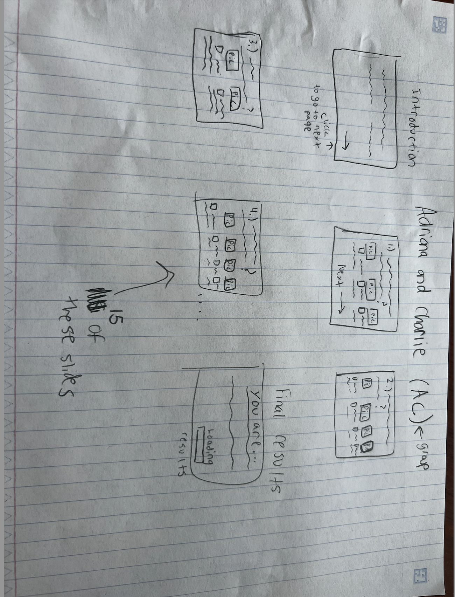

:warning: Everything between << >> needs to be replaced (remove << >> after replacing)

# Personality Quiz
## CS110 Final Project Sem. 1 2023

## Team Members

Chelsea Oliveira, Adriana Mavila

*** 

## Project Description

It is a quiz based on silly BuzzFeed quizzes. It's a personality quiz based on personal choices/interests and you must choose which option you prefer the most. The screen will change to the next with the help of an arrow key or a next button at the bottom of the screen when pressed, all the options will be functional, the user's choices are tallied and results will be given at the end.

***

## GUI Design

### Initial Design

### Final Design

## Program Design

### Features

1. Next Arrow
2. Start Screen
3. Results Page
4. Animated Backgound
5. Loading Screen

### Classes

- << You should have a list of each of your classes with a description >>

## ATP

